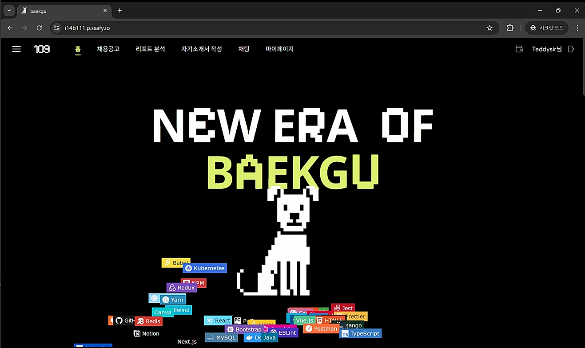
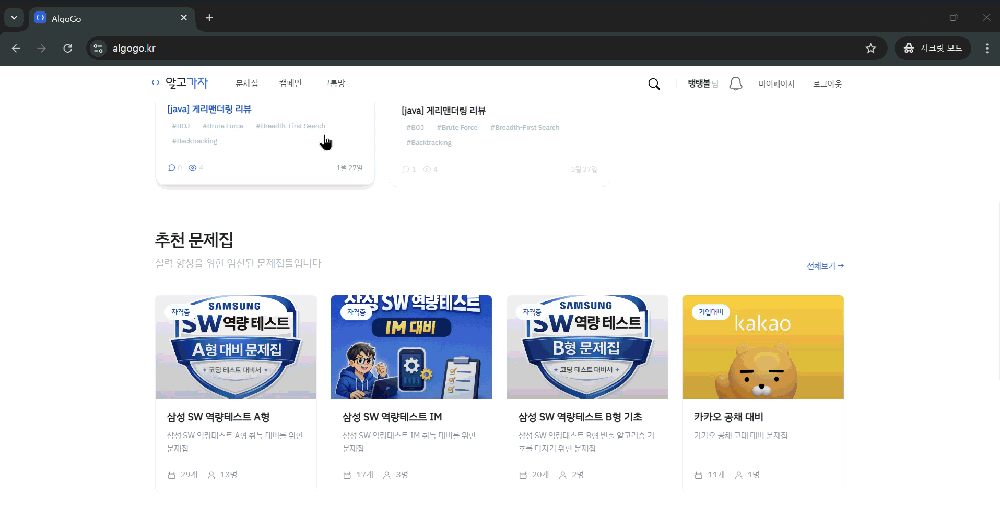
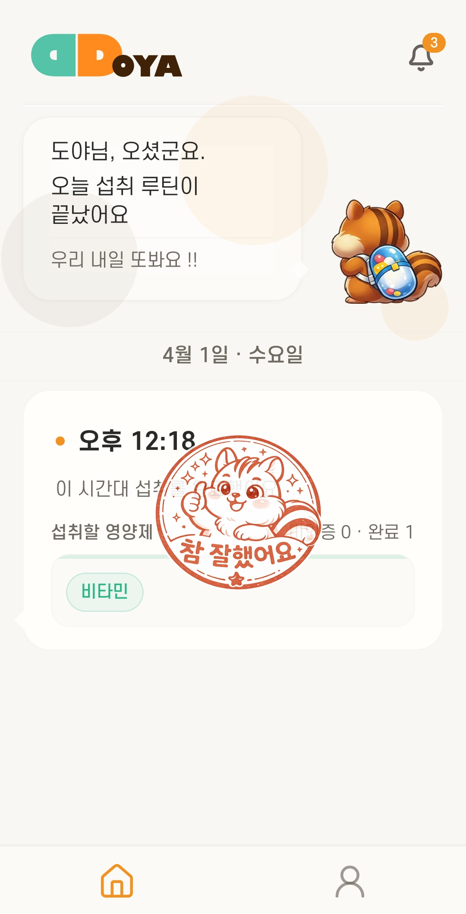
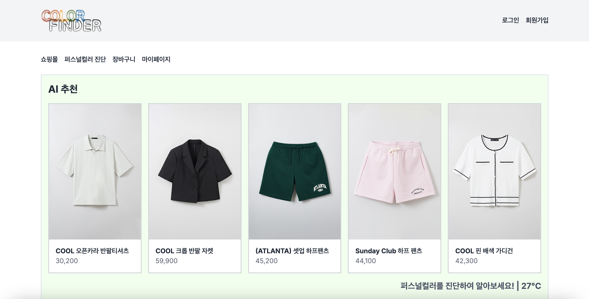



  

 

  안녕하세요! 끊임없는 문제 해결과 안정적인 아키텍처를 고민하는 <b>백엔드 개발자 이가은</b>입니다.  
  새로운 기술을 탐구하고, 기록으로 남기며 함께 성장하는 것을 즐깁니다.

 

  
  
  

 

## 🎓 Education

- **삼성 청년 SW·AI 아카데미 (SSAFY)** (2025.07 ~ 2026.06)
  - 14기 교육생 | 삼성전자 | 알고리즘 및 웹 개발 심화 과정
- **CIA Academy** (2024.07 ~ 2024.09)
  - 어학연수 | 글로벌 커뮤니케이션 능력 향상 및 문화 교류
- **한남대학교 시스템 소프트웨어 공학 연구실** (2022.10 ~ 2024.01)
  - 학부 연구생 | 논문 작성 및 최신 기술 동향 연구

---

## 🛠 Tech Stack

### 🚀 Backend

  
  
  
  
  
  
  

### 🗄️ Database

  
  
  

### ☁️ Infra & Tools

  
  
  
  
  
    
  
  
  

---

## 💻 Projects

 

| 프로젝트 이미지 | 상세 내용 |
| :---: | :--- |
|  | **BAEKGU (백구)** ▎*사용자 GitHub 기반 공고 추천 및 자소서 작성 지원 플랫폼*  사용자의 개발 역량을 객관적으로 분석하고 기업 데이터와 결합하여 최적의 커리어를 완성하는 AI 취업 솔루션입니다.  - **사용자 개발 역량 정밀 분석**: GitHub 커밋 빈도, 코드 기여도 등 실질적 활동 데이터를 기반으로 핵심 기술 역량 객관적 도출 - **지능형 기업 데이터 분석**: DART(재무제표)와 실시간 뉴스(비즈니스 트렌드)를 결합하여 기업의 안정성 및 성장성 정밀 검증 - **AI 맞춤형 공고 매칭**: 분석된 사용자 역량과 실시간 채용 데이터를 정합하여 최적의 커리어 경로 및 추천 근거 제시 - **데이터 기반 자소서 자동 작성**: 역량-공고-기업 분석 데이터를 종합하여 구체적 근거(Evidence) 중심의 고품질 자기소개서 생성 - **실시간 직무 소통 네트워크**: 공고별 오픈채팅 시스템을 통한 지원자 및 현직자 간의 투명한 정보 공유 지원  `Backend` `Infra` \| Java, Spring Boot, Redis, QueryDSL   |
|  | **Algogo (알고고)** ▎*알고리즘 스터디 운영 자동화 및 강제적 코드 리뷰 학습 플랫폼*  알고리즘 스터디의 고질적인 문제인 '리뷰 부재'를 해결하고, 상호 학습을 극대화하는 자율 운영 플랫폼입니다.  - **강제적 상호 코드 리뷰**: 새로운 코드 제출을 위해 타인의 코드를 반드시 일정 횟수 이상 리뷰하도록 유도하는 선순환 시스템 - **LLM 기반 정밀 코드 분석**: OpenAI API를 활용하여 제출된 코드의 로직 효율성, 복잡도, 예외 처리를 객관적으로 평가 및 피드백 - **스터디 운영 자동화**: 문제 출제, 미제출자 자동 알림, 트렌드 분석 기능을 통해 운영 리소스를 최소화 - **코드 라인별 계층형 리뷰**: 특정 코드 라인에 대한 피드백 및 대댓글 기능을 통해 정밀한 소통 지원 - **문제별 성취도 분석 및 통계**: 성공률, 시도 횟수, 개인별 제출 이력 등 정밀한 학습 지표 시각화로 체계적인 성취도 관리  `Backend` `Infra` \| Spring Boot, MySQL, Docker, GitLab CI/CD   |
|  | **DDOYA (또야)** ▎*인증 없이는 멈추지 않는 집착형 복약 관리 및 AI 성분 분석 서비스*  복잡한 영양제 관리를 AI 기술로 해결하고, 확실한 복용을 위해 끝까지 추적하는 '집착형' 스마트 헬스케어 솔루션입니다.  - **집착형 복약 독촉 시스템**: 복약 인증(사진 촬영)이 완료될 때까지 **1분 간격으로 끊임없이 알림**을 발송하여 확실한 당일 복약 보장 - **AI 기반 정밀 복약 인증**: 카메라 촬영 시 YOLO 모델을 활용하여 성분을 자동 분석하고, 실제 복용 여부를 픽셀 단위로 대조하여 정밀 판정 - **개인 맞춤형 영양 분석 리포트**: 복용 중인 영양제 성분을 종합 분석하여 중복 및 과다 섭취를 방지하고 최적의 섭취 가이드 제공 - **실시간 재고 및 재례구매 연동**: 복약 인증과 동시에 실시간으로 재고를 차감하며, 잔여량이 부족해지면 자동으로 재구매 알림 발송 - **성분 기반 상호작용 경고**: 약물 간 충돌이나 사용자 건강 상태에 따른 주의 성분을 AI가 사전 탐지하여 부작용 예방  `Backend` `Infra` \| Spring Boot, MySQL, FastAPI, Jenkins   |
|  | **ColorFinder** ▎*사용자 안면 색상 데이터와 실시간 기온을 결합한 맞춤형 의류 큐레이션 쇼핑몰*  사용자의 고유한 신체 색상 데이터와 외부 환경 데이터를 결합하여 최적의 스타일을 제안하는 지능형 이커머스 플랫폼입니다.  - **LAB 분석 기반 퍼스널 컬러 진단**: OpenCV와 LAB 색상 공간의 'b' 채널 분석을 통해 사용자의 피부톤을 4계절 타입으로 자동 분류하고 최적의 색상 판별 - **기상청 API 연동 실시간 기온 수집**: 공공데이터포털의 초단기예보 API를 활용하여 사용자의 현재 위치(또는 기준 좌표) 기온 데이터를 실시간 수집 및 반영 - **기온 및 퍼스널 컬러 맞춤형 의류 필터링**: 현재 기온(5도 단위)과 진단된 퍼스널 컬러 속성을 조합하여 사용자에게 최적화된 의류 카테고리를 자동 필터링 - **풀스택 이커머스 엔진 구현**: 상품 검색, 정렬(가격순/신상품순), 장바구니, 주소지 관리, 주문 및 결제 프로세스를 포함한 쇼핑 플랫폼 구현 - **개인화된 스타일 가이드**: 개인별 퍼스널 컬러 진단 기록과 이전 주문 내역을 실시간으로 관리하는 사용자 중심의 마이페이지 제공  `Backend` \| Spring, Flask, MySQL, Python   |

---

## 📊 Stats

  
  

 

  

